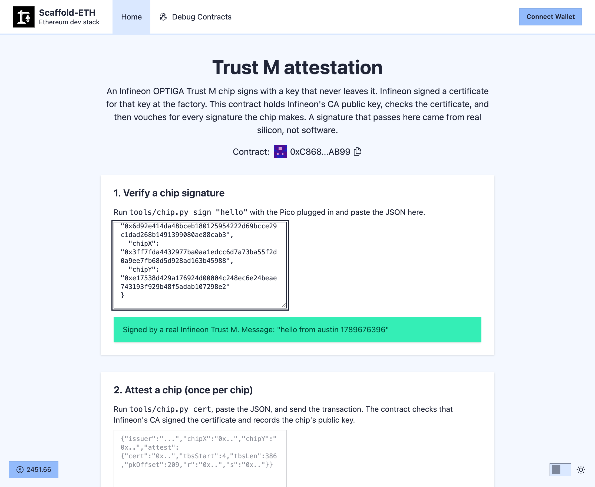

# clawd-trust-m

Prove on chain that a signature came from a real chip, not software.

The chip is an Infineon OPTIGA Trust M on an [Adafruit breakout](https://www.adafruit.com/product/4351),
driven by a Raspberry Pi Pico. Every Trust M leaves the factory with a P-256 key that never leaves the
silicon and an X.509 certificate for that key signed by Infineon. The contract here checks that certificate
against Infineon's CA public key, records the chip's key, and from then on can say "yes, a real Trust M
signed this hash".

Live on mainnet: [`0xC868770aFA2a7b7975c1a7d7Ec2fc979bbe4AB99`](https://etherscan.io/address/0xC868770aFA2a7b7975c1a7d7Ec2fc979bbe4AB99#code)
(verified source), with one chip attested
([tx](https://etherscan.io/tx/0xcddd64a65cd728366350b04758643d560fcdd6a0d4888b5e619d0c3076206484)). Its factory
certificate is in the test. dApp: [clawd-trust-m.vercel.app](https://clawd-trust-m.vercel.app).



## How the proof works

```
Infineon ECC Root CA
  └─ signs  Infineon OPTIGA(TM) Trust M CA 101        (public key pinned in the contract)
       └─ signs  the chip's factory certificate        (slot E0E0, read off the chip)
            └─ holds the chip's public key              (slot E0F0, private half never leaves the chip)
                 └─ signs  your hash                    (CalcSign over I2C)
```

`attest(cert, ...)` hashes the certificate body with SHA-256 and checks the CA's ECDSA signature with the
P-256 precompile (RIP-7212 / EIP-7951, live on mainnet and the L2s; OpenZeppelin's library falls back to
Solidity elsewhere). It pulls the public key out of the signed bytes and records it. `isChipSignature(x, y,
hash, r, s)` is then a P-256 check against a recorded key. About 65k gas to attest, a view call to verify.

Limits, plainly: this proves the chip is genuine Infineon silicon. It does not prove who owns the chip, and
the factory certificate says "Infineon IoT Node", nothing about you.

## Hardware

- Raspberry Pi Pico (any RP2040 or RP2350 board) with MicroPython.
- Adafruit Infineon Trust M breakout, product 4351.
- A STEMMA QT / Qwiic cable, four wires: GND, 3V3, SDA, SCL.

Wire GND to a Pico GND pin, V+ to 3V3 OUT (pin 36), SDA to GP4 (pin 6), SCL to GP5 (pin 7). Other pins
work too: `trustm.bus(sda=, scl=)`.

Do not trust wire colours. Adafruit's cables are black GND, red V+, blue SDA, yellow SCL, but other
cables differ (the ones used here are white GND, yellow V+, black SDA, red SCL). Check with a meter
from the wire end to the labelled hole on the breakout. A data wire on the 3V3 pin looks like a short
because the chip's protection diode feeds power back through it.

## The bus, or why an I2C scan finds nothing

The Trust M does not acknowledge its address while asleep or busy. Infineon's driver retries every 1 ms,
up to 200 times. It also needs a 50 µs guard time between one transaction's STOP and the next START; a
read issued straight after a write is refused. `firmware/trustm.py` does both. A plain `I2C.scan()` tries
once and reports an empty bus, which is not a wiring problem.

The wire protocol is Infineon's "IFX I2C": registers at 0x80 (data), 0x82 (state), 0x88 (soft reset), a
data-link layer with 2-bit frame numbers and a CRC-16 (poly 0x8408, init 0), and APDUs on top. The driver
covers OpenApplication, GetDataObject, CalcSign, GetRandom. Chip address 0x30.

## Run it

The short way, with a [Waveshare Pico-LCD-1.3](https://www.waveshare.com/wiki/Pico-LCD-1.3) hat on the Pico:

```
pip install mpremote "eth-hash[pycryptodome]"
tools/chip.py ui "hello world"
```

The screen shows the text and its keccak256. Press **A**. The chip signs, the tool checks the signature
against the mainnet contract, the screen says REAL CHIP or REJECTED, and the dApp opens in your browser
with the signature already in the URL and the verdict on the page. Press **B** to refuse. Nothing is pasted.

Without the hat, piece by piece:

```
# chip side, Pico on USB (MicroPython flashed; the firmware is copied over on every run)
tools/chip.py uid              # chip serial
tools/chip.py cert             # factory certificate + the attest() arguments, as JSON
tools/chip.py sign "hello"     # sign keccak256("hello") with the factory key, as JSON

# check that signature on mainnet without the dApp
cast call 0xC868770aFA2a7b7975c1a7d7Ec2fc979bbe4AB99 \
  "isChipSignature(bytes32,bytes32,bytes32,bytes32,bytes32)(bool)" $chipX $chipY $hash $r $s \
  --rpc-url https://eth-mainnet.g.alchemy.com/v2/$ALCHEMY_API_KEY

# contracts
cd packages/foundry && forge test     # uses the real certificate and a real chip signature

# dApp
yarn install && yarn start            # http://localhost:3000, paste the JSON from chip.py into the page
```

Setup: put `ALCHEMY_API_KEY` (and `ETHERSCAN_API_KEY` for verification) in `packages/foundry/.env` and
`NEXT_PUBLIC_ALCHEMY_API_KEY` in `packages/nextjs/.env.local`, both gitignored. `yarn start` honours a
`PORT` env var; if something else already sets one, run `yarn workspace @se-2/nextjs dev -p 3000`.

The page has two boxes: paste `sign` output to verify a signature against mainnet, paste `cert` output to
attest a new chip (one transaction, needs a wallet). It is deployed at
[clawd-trust-m.vercel.app](https://clawd-trust-m.vercel.app); redeploy with `yarn vercel:yolo --prod`.

Pico notes: `chip.py` picks the first `/dev/cu.usbmodem*`; pin it with `PICO_PORT=`. If another loop on
the Pico shares the I2C bus (the picowallet firmware polls an ATECC608 on the same pins), the tool stops
it first; a Trust M that acks its address but refuses every write is stuck mid-transaction and needs a
power cycle (unplug the USB). Give the board a
couple of seconds between back-to-back runs. If a run dies with "Device not configured" the Pico is
re-enumerating on USB; wait ten seconds and run it again, nothing on the chip is affected.

To deploy elsewhere: `yarn deploy --network <chain>`. The deploy script pins CA 101; if your chip's
certificate names a different issuer (CA 300 is common on newer chips), put that CA's public key in
`DeployTrustMAttest.s.sol`. Infineon publishes the CA certificates in the
[optiga-trust-m](https://github.com/Infineon/optiga-trust-m/tree/develop/certificates) repo (CA 300, root)
and [pred-main-xmc4700-kit](https://github.com/Infineon/pred-main-xmc4700-kit/tree/master/amazon-freertos/vendors/infineon/secure_elements/optiga_trust_m/certificates) (CA 101).

## Layout

```
firmware/trustm.py                     MicroPython driver: bus rules, link layer, commands
firmware/ui.py                         the hat: show text, sign on A, refuse on B, show the verdict
firmware/lcd.py                        Pico-LCD-1.3 driver (ST7789 + keys)
tools/chip.py                          Mac/Linux side: ui, sign, cert, uid, via mpremote
packages/foundry/contracts/TrustMAttest.sol
packages/foundry/test/TrustMAttest.t.sol   real cert, real signature, tamper cases
packages/foundry/script/DeployTrustMAttest.s.sol   pins the CA 101 public key
packages/nextjs/app/page.tsx           verify / attest page
SKILL.md                               how an agent uses this
```

Built with [Scaffold-ETH 2](https://scaffoldeth.io). MIT.
